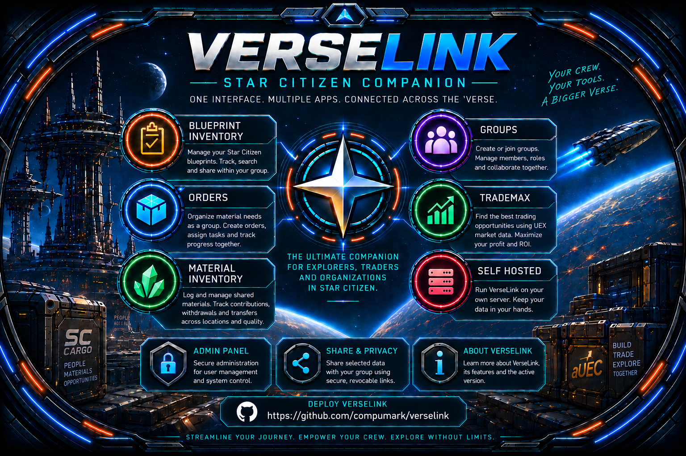

<p align="center">
  
</p>

# VerseLink

**VerseLink – Star Citizen Companion** is a web-based companion platform for Star Citizen. It connects blueprint data, material planning, group coordination, and orders in one shared mobiGlas-inspired interface.

> **Disclaimer:** VerseLink is an unofficial Star Citizen fan and companion project and is not affiliated with Cloud Imperium Games or the Cloud Imperium group of companies. Star Citizen and related names, marks, logos, and content belong to their respective rights holders. See [THIRD_PARTY_NOTICES.md](THIRD_PARTY_NOTICES.md) for details and visit the [official Star Citizen website](https://robertsspaceindustries.com/).

## What is VerseLink?

VerseLink brings several crew-oriented tools together as modules within a shared interface:

```text
VerseLink
├── 📐 Blueprint Inventory
├── 📦 Material Inventory
├── 📋 Orders
├── 👥 Groups
├── 💰 TradeMax
├── 📱 Mobiglass Interface
└── 🔐 Admin Center
```

## Blueprint Inventory

Search and manage synchronized crafting blueprints across your groups.

- Receive blueprint snapshots from SCMDB through secure sink connections
- Search by name, tag, and category
- Filter recently discovered blueprints
- Resolve reference data, images, materials, and manufacturer information
- See blueprint ownership within shared groups
- Create revocable, read-only public blueprint searches

## Material Inventory

Manage shared group material stock with quantities, quality values, storage locations, contributions, and withdrawals.

## Orders

Coordinate material requirements as group orders.

- Create and manage material orders
- Filter your own or open orders
- Claim tasks and report delivery progress
- Complete orders together

## Groups

Create groups or join existing crews to connect VerseLink features.

- Manage groups, members, roles, and permissions
- Invite members and transfer ownership
- Share blueprint and material information within a group
- Create public blueprint searches
- View crew profiles where members have enabled profile visibility

## TradeMax

**TradeMax** is VerseLink's commodity trade finder. It uses UEX market data to find profitable routes based on:

- Star system
- Ship and cargo capacity
- Available capital
- Buy stock and sell demand
- Usable SCU
- Investment, revenue, net profit, and ROI
- Market-data age and load status

TradeMax is a standalone commodity-trading module.

## Mobiglass Interface

All modules run together in one interface with shared navigation, status indicators, and Stanton, Nyx, and Pyro themes.

## Admin Center

Authorized administrators can use the protected VerseLink Admin Center for user management, SCMDB connection overview, synchronization controls, group administration, and other global administrative functions.

## The VerseLink idea

**Receive a blueprint → check stock → share it with the group → organize materials as an order → track progress → acquire missing resources.**

## Development status

Implemented capabilities include SCMDB ingestion, PostgreSQL persistence, session authentication, groups and roles, invitations, administration, filters, reference data, external images, material links, PWA foundations, and optional Discord notifications. Automated Node.js tests and UI contract tests are available; browser end-to-end coverage is still limited.

## Tech stack

- Node.js 22+ with a plain Node.js HTTP server and ES modules
- PostgreSQL 16 with `pg` 8.x
- Docker Compose and Portainer
- Server-rendered HTML, CSS, and vanilla JavaScript

## Docker and Portainer deployment

VerseLink supports both version-pinned GHCR deployments and builds directly from this repository. For production, use an explicit stable image version:

```yaml
image: ghcr.io/compumark/verselink:1.2.3
```

Image tags:

- `1.2.3`: exact stable version (recommended for production)
- `1.2`: latest stable patch in the `1.2` series
- `1`: latest stable release in major version `1`
- `latest`: latest published stable VerseLink release
- `dev`: current development build from `main`; do not use for normal production

### Production deployment with GHCR

The following is a self-contained Portainer Web Editor example using Docker named volumes. Replace every placeholder before deployment; do not commit the resulting values.

```yaml
services:
  app:
    image: ghcr.io/compumark/verselink:1.2.3
    restart: unless-stopped
    environment:
      APP_PORT: 3000
      PGHOST: db
      PGPORT: 5432
      PGDATABASE: blueprints
      PGUSER: blueprints
      PGPASSWORD: 'CHANGE_ME'
      SINK_TOKEN_PEPPER: 'CHANGE_ME'
      APP_ADMIN_USER_IDS: ''
      SCMDB_SINK_BASE_URL: 'https://verselink.example.org/v1/scmdb'
      DISCORD_WEBHOOK_URL: ''
      DISCORD_ORDERS_WEBHOOKS: ''
      VERSELINK_APP_URL: 'https://verselink.example.org'
      UEX_API_TOKEN: ''
      TZ: 'Europe/Vienna'
    ports:
      - "3000:3000"
    volumes:
      - verselink-logs:/app/logs
    healthcheck:
      test: ["CMD", "node", "-e", "fetch('http://127.0.0.1:3000/healthz').then(r => process.exit(r.ok ? 0 : 1)).catch(() => process.exit(1))"]
      interval: 30s
      timeout: 5s
      retries: 5
    depends_on:
      db:
        condition: service_healthy

  db:
    image: postgres:16-alpine
    restart: unless-stopped
    environment:
      POSTGRES_DB: blueprints
      POSTGRES_USER: blueprints
      POSTGRES_PASSWORD: 'CHANGE_ME'
    volumes:
      - verselink-postgres:/var/lib/postgresql/data
    healthcheck:
      test: ["CMD-SHELL", "pg_isready -U blueprints -d blueprints"]
      interval: 10s
      timeout: 5s
      retries: 5

volumes:
  verselink-postgres:
  verselink-logs:
```

`PGPASSWORD` and `POSTGRES_PASSWORD` must contain exactly the same strong random password. `CHANGE_ME` is only a placeholder and must be replaced before deployment. `SINK_TOKEN_PEPPER` must be a long random secret and must remain stable for an existing installation. `APP_ADMIN_USER_IDS` is optional and accepts comma-separated immutable VerseLink `app_users.id` UUIDs. `SCMDB_SINK_BASE_URL` is optional unless SCMDB synchronization is used; there is no automatic fallback. `VERSELINK_APP_URL` is the public URL of this VerseLink instance. Discord webhook variables and `UEX_API_TOKEN` are optional and may remain empty. Never commit real secrets.

Required and optional values:

| Variable | Configuration |
| --- | --- |
| `POSTGRES_PASSWORD` | Required long random PostgreSQL password. The app's `PGPASSWORD` must match it. |
| `SINK_TOKEN_PEPPER` | Required long random application secret. Keep it stable for existing installations and never commit it. |
| `APP_ADMIN_USER_IDS` | Optional comma-separated immutable VerseLink `app_users.id` UUIDs. Find a user's UUID under **About → System Information → USER ID**. Do not use display names, SCMDB/RSI handles, or `vl_...` login credentials. |
| `SCMDB_SINK_BASE_URL` | Required only for SCMDB synchronization; for example `https://verselink.example.org/v1/scmdb`. There is no default or fallback. Without it, VerseLink runs but SCMDB Sync Sink creation is disabled. |
| `VERSELINK_APP_URL` | Public base URL of the VerseLink web application, for example `https://verselink.example.org`. |
| `UEX_API_TOKEN` | Optional; only needed for UEX features requiring authenticated access. |
| `DISCORD_WEBHOOK_URL` | Optional Discord webhook URL. |
| `DISCORD_ORDERS_WEBHOOKS` | Optional JSON mapping of group names to Discord webhook URLs. |
| `DISCORD_BOT_TOKEN` | Optional server-side Discord bot token for private administrator registration notifications. |
| `DISCORD_ADMIN_USER_ID` | Optional Discord user snowflake that receives registration notifications; requires `DISCORD_BOT_TOKEN`. |
| `TZ` | Container timezone, such as `Europe/Vienna`. |

`APP_ENVIRONMENT`, `APP_VERSION`, and `APP_COMMIT` are embedded build metadata. Do not configure them manually for GHCR images.

### Optional Discord registration notifications

Set both `DISCORD_BOT_TOKEN` and `DISCORD_ADMIN_USER_ID` in the deployment's secret configuration to send a private, best-effort DM when a genuinely new VerseLink account is committed. The bot must be able to DM that Discord user. Discord failure never blocks registration, and no additional bot or webhook is required. Production and DEV deployments may use different bot tokens and recipient IDs.

### First startup

1. Create a stack or deployment directory and paste the Compose configuration.
2. Replace the placeholders, especially `POSTGRES_PASSWORD`, `SINK_TOKEN_PEPPER`, and `VERSELINK_APP_URL`.
3. Start the stack and wait for the PostgreSQL and VerseLink healthchecks.
4. Open `http://SERVER-IP:3000` or the configured reverse-proxy URL.
5. Create the first VerseLink account.
6. Open **About → System Information** and copy the **USER ID**.
7. Add that UUID to `APP_ADMIN_USER_IDS` if administrator access is required.
8. Redeploy the stack and confirm that **Admin Center** is available.

The first registered user does not automatically become an administrator.

### Portainer Web Editor

For a GHCR-based stack, use **Stacks → Add stack → Web editor**, paste the self-contained example above, replace the placeholders, and select **Deploy the stack**. The Web Editor example uses direct quoted values so it does not require external variables to be defined first.

The Web Editor example and the repository Compose files use different configuration models. For Docker Compose or `.env`-based deployments, `${VARIABLE}` interpolation remains valid and `.env.example` is the template; do not replace that syntax with the Web Editor placeholders.

### Portainer Git Repository

Alternatively, use:

- Repository: `https://github.com/compumark/verselink.git`
- Reference: `refs/heads/main`
- Compose path: `docker-compose.yml`

This current Compose file builds from repository source. It is not the same as a version-pinned GHCR deployment; the GHCR option is preferable for reproducible production releases.

If the GHCR package is public, registry authentication is not required. If it is private, configure Portainer access to `ghcr.io` with a GitHub credential/token that has package read permission. Never store that credential in the repository.

### Development images

Use `ghcr.io/compumark/verselink:dev` only for development or testing. It follows pushes to `main` and may contain unreleased changes. Use a separate database, port, log volume, and preferably a separate reverse-proxy hostname; never share production PostgreSQL data with DEV.

GHCR development-image cleanup runs daily at 03:17 UTC. It retains the newest 20 SHA-tagged development package versions and protects `dev`, `latest`, all stable release tags, and every package version with any non-SHA tag. The **Clean up old GHCR development images** workflow can also be started manually in dry-run mode.

Stable images report `Environment=Production` and their release version. DEV images report `Environment=DEV` and `Version=dev`. Both report the Git commit used to build the image under **About → System Information**.

### Reverse proxy and HTTPS

VerseLink listens on port `3000`. A reverse proxy and HTTPS are recommended for public deployments, for example `https://verselink.example.org`. HTTPS is important because VerseLink uses Secure session cookies. DNS, Cloudflare, Synology reverse proxy, nginx, Traefik, and similar infrastructure are external to VerseLink.

### Optional SCMDB synchronization

SCMDB synchronization is optional. Set `SCMDB_SINK_BASE_URL` explicitly to the publicly reachable VerseLink ingest endpoint, such as `https://verselink.example.org/v1/scmdb`. There is no default, Production fallback, or automatic URL detection. If the value is missing or invalid, VerseLink continues to run but SCMDB Sync Sink creation is disabled.

### Storage and Synology bind mounts

The standard `docker-compose.yml` uses persistent named volumes `verselink-postgres` for PostgreSQL data and `verselink-logs` for application logs. PostgreSQL data must remain persistent.

Existing installations that use explicit host directories must use `docker-compose.bind.yml` and verify their existing paths before redeployment:

```text
POSTGRES_DATA_PATH=/volume1/docker/verselink/postgres
APP_LOG_PATH=/volume1/docker/verselink/logs
```

These are example Synology paths, not requirements; other Linux hosts may use their own valid paths. Do not accidentally switch an existing bind-mount installation to a new empty named volume. See [Portainer deployment](docs/PORTAINER.md), [upgrading](docs/UPGRADING.md), and [backup and restore](docs/BACKUP_RESTORE.md).

### Local source deployment

For a local build from source:

```powershell
Copy-Item .env.example .env
# Replace POSTGRES_PASSWORD and SINK_TOKEN_PEPPER with long random values
docker compose up -d --build
```

The default Compose stack is portable and uses named volumes. Stop it with `docker compose down`.

### Healthcheck

Check `http://SERVER-IP:3000/healthz` (or the corresponding local/reverse-proxy URL). A successful response confirms that the VerseLink application container is reachable; it does not validate every external connected service.

## Routes

- `/` redirects to the productive VerseLink UI at `/mobiglass`.
- `/mobiglass` is the productive multi-module interface.
- No legacy UI route is exposed.

## Environment variables

Required: `POSTGRES_PASSWORD`, `SINK_TOKEN_PEPPER`.

Optional or defaulted: `APP_PORT`, `PGHOST`, `PGPORT`, `PGDATABASE`, `PGUSER`, `PGPASSWORD`, `DATABASE_URL`, `APP_ADMIN_USER_IDS`, and `DISCORD_WEBHOOK_URL`. `APP_ADMIN_USER_IDS` accepts only comma-separated immutable `app_users.id` UUIDs.

`SCMDB_SINK_BASE_URL` is required only when SCMDB synchronization is used. Set it explicitly to the publicly reachable ingest base URL, for example `https://verselink.example.org/v1/scmdb`. There is no default or Production fallback: without a valid value VerseLink continues to run, but creating SCMDB Sync Sinks is disabled. Self-hosted installations must use their own public URL. Do not commit secrets; use `.env.example` as the template.

## Database and backups

The schema is created and extended automatically at startup. There is currently no formal migrations directory. The portable Compose stack uses the Named Volume `verselink-postgres`. Existing Synology bind-mount deployments retain their physical directories through `POSTGRES_DATA_PATH` and `APP_LOG_PATH`; no data copy or migration is required.

Example dump:

```powershell
docker exec verselink-db pg_dump -U blueprints -d blueprints > verselink.sql
```

Restore only after creating and checking a backup:

```powershell
Get-Content .\\verselink.sql | docker exec -i verselink-db psql -U blueprints -d blueprints
```

## Checks

```powershell
node --check src/server.js
node --test
git diff --check
docker compose config --quiet
```

## Repository structure

```text
src/server.js              backend, API, schema, and HTML rendering
public/                    static pages, PWA assets, and favicon
docker-compose.yml         Docker stack
Dockerfile                 app image
.env.example               environment template
.github/workflows/         GitHub Actions workflows
docs/                      project documentation
```

## Troubleshooting

- `Invalid URL`: check `DATABASE_URL` or the PostgreSQL connection variables.
- No blueprints: check the SCMDB sink URL/token and trigger an SCMDB resync.
- Missing materials or images: inspect the external-sync logs.
- Missing changes: rebuild the current commit in Portainer and clear the browser cache.
- `/healthz` returns 404: check the reverse-proxy target and path.

Further information: [Architecture](docs/ARCHITECTURE.md), [Roadmap](docs/ROADMAP.md), [Development](docs/DEVELOPMENT.md), [Deployment](docs/DEPLOYMENT.md), [API](docs/API.md), [Changelog](docs/CHANGELOG.md), and [SCMDB technical analysis](SCMDB_Technische_Analyse.md).

Deployment references: [Portainer](docs/PORTAINER.md), [Backup and restore](docs/BACKUP_RESTORE.md), and [Upgrading](docs/UPGRADING.md).

## License

Copyright (C) 2026 VerseLink contributors.

VerseLink source code is licensed under the [GNU Affero General Public License v3.0](LICENSE) (`AGPL-3.0-only`). Third-party trademarks, names, data, logos, and assets are not covered by this license; see [THIRD_PARTY_NOTICES.md](THIRD_PARTY_NOTICES.md).

Docker build metadata is embedded automatically: DEV images report `ENVIRONMENT=DEV`, `VERSION=dev`, and the built short commit; stable release images report `ENVIRONMENT=Production`, the release version, and the built short commit.
