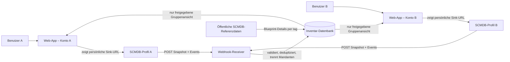

# SCMDB.net – technische Analyse und Implementierungsplan

**Stand:** 18. Juli 2026
**Untersuchungsumfang:** lokal bereitgestellte Artefakte: der JSON-Export `scmdb-compumark-2026-07-18.json` (nicht in dieses Repository kopiert) und ein Screenshot der SCMDB-Profilseite, ergänzt um die vom Nutzer verlinkte öffentliche [SCMDB Sync-Sink-Spezifikation](https://scmdb.net/docs/sync-sink-schema.md) und das öffentliche [Live-Referenzdaten-Manifest](https://scmdb.net/data/latest.json). Keine Anmeldung, keine externen Anfragen auf Kontodaten und kein Versuch, Authentifizierung oder Zugriffskontrollen zu umgehen.

## Kurzfazit

Der bereitgestellte Export belegt ein stabiles, datensparsames JSON-Format für den manuellen Ausgangsbestand. Die offizielle Sync-Sink-Spezifikation belegt einen versionierten, automatisierbaren Integrationsweg: SCMDB sendet initial einen Voll-Snapshot und danach Änderungsereignisse per HTTP an eine vom Nutzer kontrollierte URL. Das ist kein lesender Ersatz für eine REST-/GraphQL-API, aber für ein persönliches bzw. gruppenbasiertes Blueprint-Inventar genau passend.

Empfohlene Umsetzung: ein eigener Sync Sink pro App-Profil. SCMDB sendet beim Anlegen einen Start-Snapshot und danach LIVE-/HOTFIX-Änderungen; der JSON-Export bleibt ausschließlich ein manueller Wiederherstellungsweg. Dafür ist ein kleines Backend erforderlich, denn ein Browser kann keine verlässliche öffentliche Webhook-URL bereitstellen. SCMDB-Zugangsdaten werden dabei weder benötigt noch gespeichert.

## 1. Befundlage

| Artefaktklasse | Befund | Aussagekraft |
|---|---|---|
| Netzwerkaufzeichnungen (HAR, PCAP, DevTools-Export) | nicht vorhanden | Keine lesenden API-Requests, HTTP-Header oder Antwortdetails belegbar |
| Screenshot der Profilseite | vorhanden | Export-Funktion sowie bis zu fünf benutzerdefinierbare HTTP-Sinks belegt |
| JSON-Export, Formatversion 3 | vorhanden | Datenmodell für abgeschlossene Missionen und besessene Blueprints belegbar |
| Sync-Sink-Wire-Format, Schema 1 | öffentlich dokumentiert und geprüft | `POST`, `text/plain` mit UTF-8-JSON, 2xx erwartet, keine Retries, Reihenfolge nicht garantiert |
| Quellcode | nicht vorhanden | Keine Client-Implementierung oder interne Schnittstelle prüfbar |
| Git-Historie | kein `HEAD`/keine Commits | Keine früheren Artefakte vorhanden |

**Sicherheitsgrenze:** Dieser Bericht rekonstruiert keine Credentials, Tokens oder Cookies. Der personenbezogene Anzeigename aus dem Export wird weder wiedergegeben noch in das Repository kopiert. Sollten spätere HAR-Dateien solche Werte enthalten, müssen sie vor Ablage/Weitergabe bereinigt werden (z. B. `Authorization`, `Cookie`, `Set-Cookie`, CSRF-Werte und personenbezogene Antwortdaten).

## 2. Authentifizierungsanalyse

### Belegte Ergebnisse

| Fragestellung | Ergebnis |
|---|---|
| OAuth 2.0 verwendet? | Nicht belegbar |
| OpenID Connect verwendet? | Nicht belegbar |
| Session-Cookie verwendet? | Nicht belegbar |
| Bearer-/Access-Token verwendet? | Nicht belegbar |
| CSRF-Schutz vorhanden? | Nicht belegbar |

### Bewertung für eine mobile App

| Mechanismus | Eignung | Voraussetzung |
|---|---|---|
| OAuth 2.0 Authorization Code mit PKCE, optional OIDC | Geeignet | Von SCMDB offiziell bereitgestellt; registrierte Mobile-Client-ID, Redirect-URI, Scopes und Token-Refresh-Regeln |
| OAuth Device Authorization Flow | Bedingt geeignet | Offiziell angeboten; sinnvoll für Geräte ohne sicheren Browser-Redirect |
| Kurzlebige Bearer-Tokens aus einer offiziellen API | Geeignet | Tokenbindung an den aktuellen Nutzer, klarer Widerruf und dokumentierte Laufzeiten |
| Browser-/Session-Cookies eines Web-Logins | Nicht geeignet | Cookie-Übernahme/Scraping ist kein stabiler, nativer oder sicherer Integrationsvertrag |
| Aus Web-Requests abgeleitete CSRF- oder Session-Werte | Nicht geeignet | Nicht in die App übernehmen und nicht automatisiert wiederverwenden |
| Benutzername/Passwort an eigenes Backend senden | Nicht geeignet | Würde Passwortverarbeitung und erhebliches Sicherheitsrisiko einführen |

### Erforderliche Nachweise vor Implementierung

1. Offizielle SCMDB-Dokumentation bzw. schriftliche Freigabe zur Drittanbieterintegration.
2. Autorisierungs- und Token-Endpunkte sowie Client-Registrierungsprozess.
3. Zulässige Scopes für nur-lesenden Zugriff auf persönliche Blueprints.
4. Token-Lebensdauer, Refresh- und Widerrufsverfahren.
5. Redirect-URIs und unterstützte Mobile-Plattformen.
6. Datenschutz-/Nutzungsbedingungen für Speicherung, Caching und Synchronisierung.

## 3. Persönliche Blueprint-Daten

### Belegte Ergebnisse

Es liegt kein lesender Request vor, der persönliche Blueprints liefert. Der bereitgestellte Export ist jedoch ein belastbarer Snapshot des eigenen Profils.

| Gesuchte Eigenschaft | Befund |
|---|---|
| Request-URL und HTTP-Methode | Nicht belegbar |
| Pflichtparameter | Nicht belegbar |
| JSON-Exportstruktur | Belegt: Wurzel `version`, `exportedAt`, `profile`, `missions`, `blueprints` |
| Blueprint-Felder | Belegt: `tag`, `name`, `url`, `completed`, `favorite` |
| Kennzeichnung „besessen“ | Starkes Indiz: alle 67 Blueprint-Einträge haben `completed=true`; die Profil-UI weist gleichzeitig 67 „blueprints owned“ aus. Vor einer festen Geschäftsregel mit Sink-Ereignissen/API-Spezifikation validieren. |
| Pagination | Nicht vorhanden im Export; für einen späteren lesenden Endpunkt nicht belegbar |
| Suche/Filter | Nicht als Serverparameter belegbar; lokal auf `tag`, `name` und `favorite` implementierbar |

Der Export enthält 184 Missionen und 67 Blueprints. Alle exportierten Missions- und Blueprint-Einträge sind `completed=true`; bei Missionen ist ein Favorit, bei Blueprints keiner markiert. Alle Blueprint-Tags sind vorhanden und untereinander eindeutig. Die Export-URLs zeigen auf `scmdb.net`; sie belegen **keine** freigegebene Daten-API.

### Bedeutung für die Synchronisierung

Der JSON-Export eignet sich als manueller Wiederherstellungs-/Neuaufbauweg. Im Normalfall liefert SCMDB beim Anlegen, manuellen Resync oder Reaktivieren einer Sink-Kategorie bereits einen vollständigen Snapshot; danach folgen Änderungen. Der Sink bleibt einseitig: SCMDB liest nicht aus unserem System zurück.

### Prüfplan für ein späteres, bereinigtes Netzwerkprotokoll

Nur mit dem vom Nutzer selbst authentifizierten Testkonto und ohne Speichern sensibler Werte:

1. Mit einem eigenen Testkonto einen einzelnen, datensparsamen Sink-Test durchführen.
2. Die dokumentierten Pflichtpunkte verifizieren: `POST`, `text/plain`, Envelope `schema: 1`, `event_id`, `ts` und Blueprint-Snapshot.
3. Prüfen, dass die Blueprint-Ereignisse `tag` und `product_name` vollständig liefern und Entfernen korrekt abgebildet wird.
4. Einen Start-Snapshot und einen manuellen Resync vergleichen, um Snapshot-Ersetzung und Besitzsemantik zu validieren.
5. Fehlerfälle (Duplikat, falsche Reihenfolge, nicht unterstütztes Schema, alte Sink-URL) automatisiert testen.

### Zielschema (nur App-intern; nicht als behauptetes SCMDB-JSON)

```text
Blueprint
├─ id: String
├─ name: String
├─ description: String?
├─ category: Category?
├─ ownership: owned | notOwned | unknown
├─ imageUrl: Uri?
├─ requiredComponents: List<ComponentRequirement>
├─ requiredMaterials: List<MaterialRequirement>
├─ metadata: Map<String, String>  // nur freigegebene Felder
└─ updatedAt: DateTime?

ComponentRequirement / MaterialRequirement
├─ id: String?
├─ name: String
├─ quantity: Decimal?
└─ imageUrl: Uri?
```

Im Export wird `completed=true` als `owned` abgebildet, da Exportzählung und Profil-UI exakt übereinstimmen. Für die automatische Synchronisierung ist die Semantik nun ausdrücklich belegt: `blueprint.snapshot.payload.owned[]` liefert den Besitzstand, `blueprint.owned.added` fügt ihn hinzu und `blueprint.owned.removed` entfernt ihn. Der Status wird nie aus einer allgemeinen öffentlichen Blueprint-Liste abgeleitet.

## 4. Allgemeine Blueprint-Daten

Der Export belegt für persönliche Blueprints `tag` (geeigneter Kandidat für eine stabile Blueprint-ID), `name`, `url`, `completed` und `favorite`. Er enthält keine Beschreibung, Kategorie, Komponenten, Materialien, Bilder oder weitere Detailattribute.

Die oben beschriebene App-Domäne ist bewusst ein **Zielmodell**, das erst nach Analyse einer freigegebenen Datenquelle auf konkrete Feldnamen, Typen und Nullability abgebildet werden darf. Bilder sollten nur über freigegebene HTTPS-URLs geladen und mit Größenlimits sowie Caching-Regeln behandelt werden.

## 5. API-Bewertung

### Aktuelle Klassifizierung

| Kategorie | Ergebnis | Konsequenz |
|---|---|---|
| 1. Offiziell dokumentierte API | Nicht nachgewiesen | Vorzugslösung für lesende Detaildaten, aber erst nach Dokumentation/Freigabe verwenden |
| 2. Öffentlich zugänglicher API-Endpunkt | Nicht nachgewiesen | Öffentlich erreichbar bedeutet nicht automatisch zur Drittanbieternutzung freigegeben |
| 3. Interner Web-Endpunkt | Nicht nachgewiesen | Bei späterem Fund nicht als mobile API voraussetzen |
| 3a. Vorgesehener ausgehender Sync Sink | Offiziell dokumentiertes Schema 1 | Geeignet für ereignisgetriebene, einseitige Synchronisierung; kein Ersatz für Suche nach unbekannten Daten oder Detailabfragen |
| 4. Nicht geeignete/unsichere Zugriffsmethode | Browser-Cookies, Passwortweitergabe und Nachbildung von CSRF-/Session-Mechanismen | Nicht implementieren |

Aus den vorhandenen Daten kann nicht bestimmt werden, ob SCMDB REST, GraphQL oder andere lesende Schnittstellen verwendet. Selbst ein JSON-Endpunkt in einer Webanwendung wäre zunächst ein interner Web-Endpunkt, sofern keine öffentliche Dokumentation und Nutzungserlaubnis vorliegt. Der Sink ist demgegenüber eine im Profil angebotene **Push-Integration** mit festem Schema 1; es gibt bewusst keine Retries und keine garantierte Lieferreihenfolge. Eine kryptografische SCMDB-Signatur ist in der Spezifikation nicht vorgesehen, daher schützt die zufällige Sink-URL den Empfang.

### Verbindlicher Sink-Vertrag für den MVP

| Bereich | Belegter Vertrag | Umsetzung |
|---|---|---|
| Initialzustand | Beim Anlegen, Resync oder Reaktivieren einer Kategorie kommt ein Snapshot | Snapshot ersetzt den Besitzstand der betreffenden Verbindung transaktional |
| Blueprint-Ereignisse | `blueprint.snapshot`, `blueprint.owned.added`, `blueprint.owned.removed` | Besitz nur über `tag` als stabilen Schlüssel führen; `product_name` nur anzeigen |
| Nutzeridentität | `user.id` stabil; `user.handle` änderbar und optional | `user.id` intern binden; Handle nur als Anzeige nach Einwilligung behandeln |
| Transport | HTTPS-`POST`, Header `Content-Type: text/plain`, Body UTF-8-JSON | Body trotz Content-Type als JSON parsen; mit 2xx antworten |
| Zuverlässigkeit | keine Retries, keine Lieferreihenfolge | `event_id` deduplizieren, `ts` anwenden, Resync-UX vorsehen |
| Größe/Last | Snapshots bis etwa 64 KB; Bursts bis etwa 10 Requests/s pro Nutzer möglich | Requestlimit >64 KB ablehnen, Endpoint und Datenbank auf kurze Bursts auslegen |
| Versionierung | Event-Schema 1 ist gesperrt; additive Felder möglich | `schema` strikt verzweigen, unbekannte optionale Felder/Ereignisse fehlertolerant ignorieren |

Der MVP darf auf diesem dokumentierten Sink-Vertrag und den öffentlichen Referenzdaten aufbauen. Es gibt keinen Grund, interne Web-Endpunkte zu verwenden. Eine später entdeckte Lese-API wäre eine optionale Erweiterung für reichere Daten, nicht die Grundlage des Inventars.

## 6. Multi-User- und Sicherheitskonzept

### Datenfluss



### Grundregel der Mandantentrennung

Die Web-App hält pro App-Konto ein getrenntes Inventarprofil. Sie verwendet niemals eine frei übergebene SCMDB-Benutzer-ID zur Auswahl persönlicher Daten. Die Zuordnung geschieht durch die zufällige, persönliche Sink-URL und wird beim ersten Snapshot mit der stabilen SCMDB-`user.id` gebunden. Bei späteren Events muss dieselbe SCMDB-`user.id` eintreffen; eine Abweichung wird verworfen und als Sicherheitsereignis markiert.

| Thema | Konzept |
|---|---|
| Benutzer A und B | Separate App-Konten und getrennte Sink-Zuordnungen; ein Gruppenzugriff ersetzt keine Eigentumsübertragung |
| Datenisolation | Jede Tabelle trägt die interne `member_id`; jede Leseabfrage erzwingt Gruppenmitgliedschaft und Sichtbarkeitsfreigabe |
| Zugriff auf persönliche Daten | Der Sink-Token im URL-Pfad bestimmt die interne Zielperson; die SCMDB-`user.id` ist ein serverseitiger Plausibilitätscheck, nie ein clientseitiger Zugriffsparameter |
| Lokale Speicherung | Persönliche Browserdaten minimal halten; Sitzungs-Cookies `HttpOnly`, `Secure`, `SameSite=Lax/Strict`; keine Sink-URL im Local Storage |
| SCMDB-Tokens | Nicht vorhanden und nicht erforderlich |
| Passwörter | SCMDB-Passwörter werden nie abgefragt, gespeichert oder verarbeitet |
| Sink-Rotation / Trennung | Neue zufällige Sink-URL generieren, alte sofort deaktivieren; neue URL einmalig anzeigen; Ereignisse an die alte URL ablehnen |
| Logout | Nur die Web-App-Sitzung invalidieren und Sitzungs-Cookies löschen; SCMDB bleibt unverändert |
| Telemetrie | Sink-Token und vollständige URL aus Logs, Traces, Error-Reports und Analytics entfernen; eingehende Payloads nicht pauschal protokollieren |

### Direkte Kommunikation oder Backend?

**Option A – direkte Kommunikation Web-App → SCMDB** ist für das vorliegende Sink-Modell nicht sinnvoll: Ein Browser kann keine dauerhaft öffentliche, sichere Empfangsadresse bereitstellen. Eine spätere offizielle Lese-API könnte für optionale Detaildaten direkt verwendet werden, ist für den MVP aber nicht nötig.

**Option B – Web-Backend mit Webhook-Receiver** ist zwingend: Es stellt die HTTPS-Sink-URLs aus, nimmt Events entgegen, prüft sie und liefert der Web-App nur berechtigte Daten. Es ist **nicht** dazu da, SCMDB-Web-Sessions nachzubilden oder Passwörter zu verarbeiten.

Für den jetzigen Kenntnisstand wird ein schlankes Backend ab Projektbeginn empfohlen. Es benötigt keine SCMDB-OAuth-Tokens; einzig die Sink-URL ist ein Write-Credential und wird nur gehasht gespeichert.

### Sink-, Session- und Ereignisdesign

| Komponente | Umsetzung |
|---|---|
| Sink-URL | `https://ingest.<domain>/v1/scmdb/<256-bit-zufall>`; pro Verbindung einzigartig, einmalig sichtbar, in der Datenbank nur als HMAC-/Hashwert abgelegt |
| Empfang | Ausschließlich `POST`, höchstens 64 KB Body, `text/plain` akzeptieren und anschließend UTF-8-JSON parsen; alle anderen Methoden ablehnen |
| Envelope-Prüfung | `schema === 1`, Pflichtfelder und Typen validieren; unbekannte optionale Felder/Ereignisse ignorieren und sicher protokollieren |
| Identitätsbindung | Beim ersten gültigen Snapshot die SCMDB-`user.id` an die Verbindung binden; spätere Abweichungen mit 403 ablehnen |
| Idempotenz | `event_id` global eindeutig speichern; Duplikate mit 2xx bestätigen, ohne Zustand ein zweites Mal zu ändern |
| Reihenfolge | Pro Entität nur ein Event mit neuerem `ts` anwenden; Snapshots transaktional ersetzen und mit Snapshot-Zeitpunkt schützen |
| Ausfall | SCMDB retryt nicht. Die UI zeigt „letztes Ereignis“; Nutzer kann in SCMDB einen manuellen Re-Sync auslösen |
| App-Sitzung | Authentifizierte, kurzlebige Web-App-Sitzung mit serverseitiger Nutzerbindung; SCMDB-`user.id` ist kein Login für die Web-App |
| Schlüsselverwaltung | HMAC-Pepper, Datenbank- und App-Auth-Secrets nur im Secret Store/Deployment-Environment; niemals im Repository oder Client-Bundle |

## 7. Architekturentscheidung: Web-App

Die gewünschte Besitzer-Suche für Freunde ist eine gemeinschaftliche Web-Anwendung, nicht primär eine Einzelplatz-Mobile-App. Eine responsive Web-App kann auf Telefon, Tablet und Desktop genutzt und später bei Bedarf als PWA installiert werden.

### Klare Empfehlung

**Next.js mit TypeScript** für das minimalistische Webinterface, **PostgreSQL** für Daten und Rechte, ein **separater HTTPS-Webhook-Receiver** für die SCMDB-Sinks und eine etablierte Passwortlos-/E-Mail- oder Passkey-Authentifizierung für die Web-App. Der Receiver kann als isolierte Edge-/Serverless-Funktion betrieben werden; App und Receiver teilen dieselbe Datenbank, aber keine SCMDB-Zugangsdaten.

| Schicht | Empfehlung | Aufgabe |
|---|---|---|
| Webinterface | Next.js, TypeScript, Tailwind CSS, zugängliche Komponentenbibliothek | responsive Inventarliste, Filter, Detailansicht, Gruppen, Einladung und Verbindungseinrichtung |
| Anwendung | Server Actions/API-Routen oder separates TypeScript-Backend | Berechtigungsprüfung, Gruppenverwaltung, Suchabfragen |
| Webhook | isolierter HTTPS-Endpunkt, z. B. Edge-/Serverless-Function | Sink-Token prüfen, `text/plain`-JSON verarbeiten, Idempotenz und Snapshot-Transaktionen |
| Authentifizierung | Auth für **unsere** App (Passkey oder E-Mail-Link) | App-Konto und Sitzung; keine SCMDB-Anmeldung |
| Datenbank | PostgreSQL mit Row-Level-Security oder gleichwertig erzwungenen Repository-Regeln | Mitglieder, Gruppen, Verbindungen, Besitzstände, Ereignisse und Referenzdaten |
| Referenzdaten | `latest.json` stündlich prüfen, LIVE-Datei versioniert cachen | Details/Felder zu Blueprint-`tag`; PTU bewusst ignorieren |

Der öffentliche Manifeststand vom 18. Juli 2026 liefert für LIVE eine `crafting_blueprints`-Datei mit 1.597 Blueprint-Datensätzen. Belegt sind mindestens `guid`, `tag`, `productName`, `manufacturer`, `type`, `subtype` und Tiers mit Crafting-Zeit und Slots. Das genügt für Suche, Typ-/Hersteller-/Tierfilter und Details; Material- und Komponentenansichten werden erst nach fachlicher Zuordnung der weiteren Referenzfelder implementiert.

### MVP-Oberfläche

```text
┌────────────────────────────────────────────────────────────────────┐
│ Blueprint Inventory             Meine Gruppe ▾      Profil          │
├───────────────┬────────────────────────────────────────────────────┤
│ Suche         │ Voltic Long-Arm Rifle                     [Details] │
│ [____________]│ Hersteller · Typ · Tier                            │
│               │ Besitzende in „Meine Gruppe“                       │
│ Hersteller ▾  │  • Alex                                            │
│ Typ ▾         │  • Sam                                             │
│ Tier ▾        │                                                    │
│ Nur verfügbar │ Weitere Treffer …                                  │
│ bei Freunden  │                                                    │
└───────────────┴────────────────────────────────────────────────────┘
```

Startumfang: Volltextsuche nach Name/Tag, Filter für Hersteller/Typ/Subtyp/Tier, „bei Freunden verfügbar“, Detailseite, eigene Besitzliste, Gruppen mit Einladungen sowie „SCMDB verbinden“ mit einmalig angezeigter Sink-URL und Verbindungstatus. Favoriten werden als optionale eigene Notizfunktion später ergänzt.

### Datenmodell für den MVP

| Tabelle | Primär-/Fremdschlüssel | Zweck |
|---|---|---|
| `app_users` | `id` | Konto in unserer Web-App |
| `groups` / `group_members` | `group_id`, `app_user_id` | geschlossene Freundesgruppen und Rollen |
| `scmdb_connections` | `id`, `app_user_id`, `sink_token_hash`, `scmdb_user_id` | eine SCMDB-Verbindung; `scmdb_user_id` erst nach erstem Snapshot binden |
| `blueprints` | `tag` | öffentliche LIVE-Referenzdaten, inklusive Version und Suchfeldern |
| `member_blueprints` | `(connection_id, tag)` | gegenwärtiger Besitzstand, Quelle und letzter `ts` |
| `scmdb_events` | `event_id` | Idempotenz, Empfangszeit und minimaler Verarbeitungsstatus |
| `group_visibility` | `(group_id, app_user_id)` | explizite Einwilligung, dass andere Gruppenmitglieder den Besitzstand finden dürfen |

Die Besitzer-Suche ist eine serverseitig berechtigte Join-Abfrage: `blueprints` → `member_blueprints` → sichtbare `group_members`. Sie liefert niemals die SCMDB-`user.id`, Sink-URLs, Ereignisprotokolle oder Besitzstände von Nichtmitgliedern.

### Dauerbetrieb auf einer Synology-NAS

Für einen privaten MVP ist eine Synology mit **Container Manager** geeignet. Da die Sink-URLs für Freunde aus dem Internet erreichbar sein müssen, ist eine interne NAS-IP allein nicht ausreichend. Empfohlen ist ein eigener Domainname mit [Cloudflare Tunnel](https://developers.cloudflare.com/tunnel/): Der Tunnel baut von der NAS aus nur ausgehende Verbindungen auf und veröffentlicht HTTPS-Hostnamen ohne Router-Portfreigabe oder feste öffentliche IP.

Da bereits ein Synology-Reverse-Proxy mit gültigen HTTPS-Hostnamen vorhanden ist, kann der erste MVP auch direkt darüber laufen. Empfohlene Einträge:

| Beschreibung | Source | Destination |
|---|---|---|
| Blueprint Inventory | `https://blueprints.<deine-domain>` | `http://localhost:3000` |
| SCMDB Sink Receiver | `https://ingest.<deine-domain>` | `http://localhost:3000` |

Beide Hostnamen dürfen auf denselben Webcontainer zeigen; die Anwendung trennt normale Web/API-Routen von `/v1/scmdb/<token>`. Ein separater Receiver-Container auf Port `3001` ist später möglich, wenn die Angriffsfläche weiter getrennt werden soll. Für den Sink muss der Reverse Proxy `POST` mit `Content-Type: text/plain` und einem Body bis mindestens 64 KB unverändert an den Container weiterreichen; keine Authentifizierungsseite oder zusätzliche Browser-Anmeldung vor den Sink-Host setzen.

```text
Freundlicher Browser mit SCMDB
  └─ HTTPS POST → ingest.<eigene-domain> / v1 / scmdb / <persönlicher-zufall>
                     └─ Cloudflare Tunnel (ausgehend von NAS)
                        └─ Synology Container Manager
                           ├─ Web-App + API
                           ├─ Webhook-Receiver
                           └─ PostgreSQL

Benutzerbrowser
  └─ HTTPS → inventory.<eigene-domain> → dieselbe Web-App
```

| Container | Aufgabe | Von außen erreichbar? |
|---|---|---|
| `web` | Webinterface, Auth und berechtigte API | über `inventory.<domain>` |
| `receiver` | Minimaler `POST`-Endpoint für SCMDB-Sinks | über `ingest.<domain>`; nur Schreibzugriff |
| `postgres` | Anwendungstabellen und Suchindex | nein |
| `cloudflared` | ausgehender Tunnel zur Veröffentlichung beider Hostnamen | nein |

**Betriebsregeln:** Keine Router-Portfreigabe für die Datenbank; `ingest` darf nicht mit Cloudflare Access geschützt werden, weil der SCMDB-Browser keinen Access-Login besitzt. Stattdessen sichert der zufällige Sink-Pfad den Schreibzugriff. `web` besitzt eine normale App-Anmeldung. NAS, Container und Datenbank benötigen automatische Sicherheitsupdates, tägliche verschlüsselte Backups, eine USV und ein sichtbares „letztes SCMDB-Ereignis“-Monitoring.

Die Verfügbarkeit ist fachlich wichtig: SCMDB liefert Events nicht erneut. Wenn NAS, Tunnel oder Internet ausfallen, kann ein Ereignis verloren gehen. Die Verbindungseinstellungen müssen deshalb einen klaren Hinweis und einen „in SCMDB Resync auslösen“-Schritt enthalten; der neue Snapshot stellt den Besitzstand wieder konsistent her.

## 8. Risiken und Gegenmaßnahmen

| Risiko | Auswirkung | Gegenmaßnahme |
|---|---|---|
| Keine Zustellungswiederholung | Verlorene Änderungen bei Endpoint-Ausfall | Health-Checks, Monitoring und sichtbarer „letztes Ereignis“-Status; Nutzer löst in SCMDB manuellen Resync/Snapshot aus |
| Sink-URL-Leak | Unbefugte, gefälschte Events für eine Verbindung | 256-Bit-Zufallstoken, nur Hash/HMAC speichern, URLs redigieren, Rotation; `user.id` gegen gebundenen Wert prüfen |
| Ungeordnete/duplizierte Events | Falscher Besitzstand | `event_id`-Deduplizierung, `ts` als Ordnungswert, transaktionale Snapshot-Anwendung |
| Öffentliche Besitzer-Suche | Datenschutz-/Social-Engineering-Risiko | Standard: nur eingeladene geschlossene Gruppen; Mitglied muss Sichtbarkeit ausdrücklich aktivieren |
| Änderung der Referenzdaten | Veraltete Details/Filter | Manifest-Version und Datei-URL per TTL prüfen, Datenversion am Cache speichern |
| Benutzer löscht/pausiert Sink | Inventar wird nicht aktualisiert | Verbindung als „wartet auf Ereignis“ kennzeichnen; keine stillschweigende Neuanlage oder Umgehung |
| Übermäßiges Caching | Datenschutzrisiko | Nur notwendige Besitzstände und öffentliche Referenzdaten speichern; Löschfunktion für Konto und Gruppe |

## 9. Empfohlener nächster Schritt

1. **Produktregel festlegen:** Besitzer-Suche ausschließlich in geschlossenen, eingeladenen Freundesgruppen; Sichtbarkeit ist Opt-in und standardmäßig aus.
2. **Fundament aufsetzen:** Next.js-/TypeScript-Repository, CI, Datenbankmigrationen, Secret-Handling und passwortlose Web-App-Authentifizierung.
3. **Webhook vertikal fertigstellen:** Sink-URL erzeugen, Endpoint mit Schema-1-Validierung bauen, Snapshot/`added`/`removed` verarbeiten, Deduplizierung und `ts`-Regeln testen.
4. **Referenzdaten importieren:** LIVE-Manifest und Blueprint-Datei versioniert laden; Suchindex auf `tag`, Produktname, Hersteller, Typ, Subtyp und Tier anlegen.
5. **Minimalistisches MVP bauen:** eigene Besitzliste, Gruppen/Einladungen, Besitzer-Suche und Blueprint-Detailansicht.
6. **End-to-End testen:** zwei eigene Testkonten, zwei getrennte Sink-URLs, Snapshot, Add/Remove, Duplicate, Out-of-order und Sink-Rotation prüfen. Keine Freunde oder fremden Konten bis zu diesem Sicherheitsnachweis einbinden.

## Anhang: Abnahmekriterien für die nächste Analyse

- Jeder eingehende Request entspricht der dokumentierten Sink-Schema-Version und enthält keine geloggten Geheimnisse.
- `event_id` ist eindeutig, ein Snapshot ist transaktional und der Besitzstand eines Mitglieds kann kein anderes Mitglied verändern.
- Eine Sink-URL lässt sich rotieren; die alte URL wird danach abgelehnt und der Nutzer sieht die neue URL nur einmal.
- Besitzer-Suche zeigt ausschließlich Mitglieder derselben Gruppe mit aktivierter Sichtbarkeit.
- LIVE-Referenzdaten sind versionsgebunden; PTU-Daten werden nicht in den gemeinsamen Inventarbestand gemischt.
