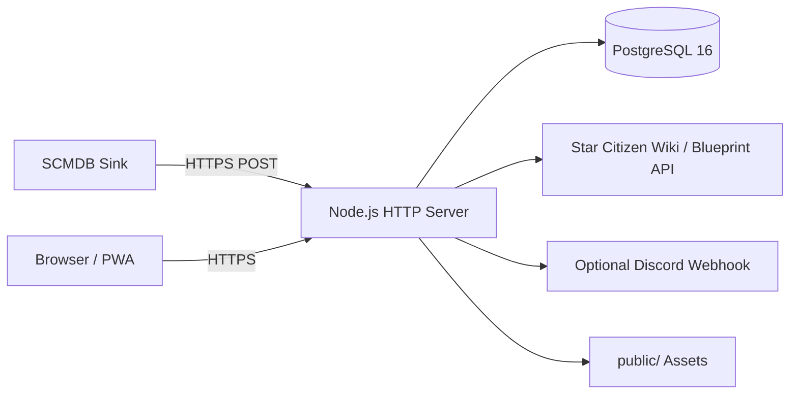

# Architektur

## Übersicht

## Komponenten

- **App**: `src/server.js`; HTTP-Routing, Authentifizierung, HTML, JSON-API, Schema-Setup und Synchronisierungen.
- **PostgreSQL**: persistiert Benutzer, Connections, Sessions, Gruppen, Einladungen, Events, Blueprint-Besitz und Referenzdaten.
- **public**: Login, Gruppen, Changelog, Manifest, Service Worker und Favicon.
- **SCMDB**: sendet Snapshots und Profile über konfigurierte Sink-URLs. Die öffentliche Sink-Basis kommt ausschließlich aus der Deployment-Variable `SCMDB_SINK_BASE_URL`; sie ist nicht im Anwendungscode hinterlegt.
- **Externe Referenzen**: liefern Kategorien, Bilder und Materialien; sie sind keine Besitzdatenquelle. Öffentliche RSI-Profile werden ausschließlich auf ausdrücklichen Benutzeraufruf abgerufen und als Profilcache gespeichert.
- **Discord**: optionaler Webhook für neue Blueprint-Events und Changelog-Automation.
- **API-Logs**: authentifizierte API-Anfragen werden zusätzlich als Tagesdateien unter `/app/logs/YYYY-MM-DD.log` geschrieben. Die portable Compose-Installation verwendet dafür das Named Volume `verselink-logs`; bestehende Bind-Mount-Installationen verwenden `APP_LOG_PATH`.
- **Einladungen**: neue Einladungen laufen 14 Tage später um 00:00 Uhr des Folgetags ab. Ein täglicher Cleanup läuft um 00:10 Uhr in der Container-Zeitzone (`Europe/Vienna`) und löscht abgelaufene Einladungen.
- **Public Search**: separates, read-only API mit gruppenbezogenem Share-Token; kein Zugriff auf Besitzer- oder Sessiondaten.

## Datenfluss

1. Benutzer erstellt in SCMDB einen Sink mit eigenem Token.
2. SCMDB sendet Profil-/Blueprint-Events an `/v1/scmdb/<token>`.
3. Das Backend validiert Envelope und Token, speichert Event und Blueprint-Zeilen und ordnet den Connection einem App-User zu.
4. Neue Blueprints erhalten `first_seen_at`; fehlende Snapshot-Zeilen werden entfernt.
5. Referenz-/Material-/Bild-Synchronisierung ergänzt `reference_blueprints`.
6. Ein Browser startet mit dem Sink-Token eine Session.
7. Blueprint-Abfragen erlauben nur Daten von Benutzern, die mit dem aktuellen Benutzer mindestens eine Gruppe teilen.

## Datenbank

Wichtige Tabellen:

- `scmdb_connections`: gehashter Sink-Token, SCMDB-Handle und App-User
- `app_users`: Anzeigename, Admin- und Statusfelder
- `blueprint_groups`, `group_members`: Gruppen und Rollen
- `group_invites`: gehashte und für UI angezeigte Einladungscodes
- `member_blueprints`: Besitz je Token und Tag
- `reference_blueprints`: normalisierte Metadaten, Bilder und Materialien
- `scmdb_profiles`, `scmdb_events`, `dashboard_sessions`

Das Schema wird aktuell beim Start inline initialisiert; ein formales Migrationssystem fehlt.

## Authentifizierung und Berechtigungen

Sink-Tokens werden mit HMAC und `SINK_TOKEN_PEPPER` gehasht. Sessions verwenden einen gehashten Cookie-Wert und Ablaufzeit. Die App prüft Benutzerstatus und Rollen serverseitig. Owner dürfen ihre Gruppen verwalten; globale Admins werden beim Start ausschließlich aus `APP_ADMIN_USER_IDS` anhand der unveränderlichen `app_users.id` synchronisiert. Nur aktive Konten können effektiv Administratoren sein.

Öffentliche Links verwenden einen eigenen HMAC-Domain-Prefix (`public-link:`), werden nur als Hash gespeichert und können deaktiviert oder mit Ablaufdatum versehen werden. Die Public-Abfrage ist vollständig getrennt von `accessibleBlueprintQuery`, gruppiert nach Blueprint-Tag und selektiert keine Besitzer- oder Benutzerfelder. Der Klartext-Link wird nur bei der Erstellung zurückgegeben.

## Deployment und Speicher

Compose startet `app` und `db`. App-Port ist 3000, DB-Port 5432 nur im Compose-Netzwerk. PostgreSQL wird in der portablen Standardinstallation dauerhaft im Named Volume `verselink-postgres` gespeichert. Bestehende Synology-Installationen können ihren unveränderten Hostpfad über `POSTGRES_DATA_PATH` einbinden. HTTPS, DNS und Reverse Proxy sind externe Infrastruktur.

## Fehlerbehandlung und Logging

Fehler werden als HTTP-Status/JSON oder HTML-Fehler geliefert. Syncs und Sink-Annahmen nutzen Präfixe wie `[sink]`, `[materials]`, `[images]`, `[reference]` und `[discord]`. Tokens und Webhook-Geheimnisse dürfen nicht geloggt werden.
